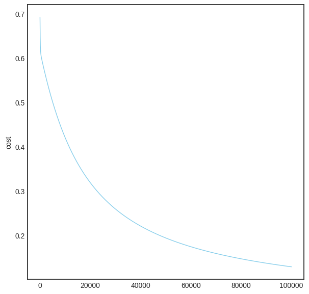

## Statistical Models and Methods in ML

### Regression Analysis (Linear and Logistic Regression)

#### 3.1.3 <span style="color:#072BB8">Logistic Regression</span>

***Introduction***

Logistic regression is a parametric method used on a *categorical* dependent variable (target). It models the probabilities for classification problems with two or more possible outcomes. It is an extension of the linear regression model for classification problems. In difference to the linear regression, whose predictions are continuous, the predictions of the logistic regression are discrete.

***Types of Logistic Regression***

Types of Logistic Regression:
* Binary
* Multinomial
* Ordinal

Here, we will treat the case of the binary logistics regression.

***The Model***

The basic idea behind the process of training logistic regression is creating a boundary edge between lables, i.e., maximizing the likelihood of the hypothesis that the data are split by sigmoid, i.e., maximizing the accuracy of predictions. The method searches for the optimal coefficients of the ***sigmoid function***, which are iteratively approximated while the ***loss function*** is minimised. In the case presented here, it is minimised with ***gradient descent***, although this is not the only option.

***Hypothesis***

The function that the algorithm outputs is denoted by $h$ and referred to as the ***hypothesis***. This function takes an input value $x$ and uses parameters $\theta_i$ determined by the learning algorithm to estimate the predicted value $y$.

The hyptohesis, as a function of $x$, can be written as

$$h_{\theta}(x) = \theta_0 x_0 + \dots + \theta_n x_n$$

where $x_1,\dots x_n$ represents the features of an $n$-dimensional feature vector; $\theta_i$ represents parameters (weights) determined by the cost function ($\theta_0$ is the zero condition; $\theta_1$ is the gradient).
<br><br>
For instance, if we are interested in predicting house prices, which would form the output variable $y$, it might be the case that we would have $n=4$ features and that they would be as follows: $x_1$ — surface area; $x_2$ — number of bedrooms; $x_3$ — number of floors; $x_4$ — age of the house.
<br><br>
Additional notation:
* $m$ — number of samples (the number of rows in a table).
* $x^i$ — vector of the input for the i-th example
* $x_j^i$ — the value of feature j in the i-th training example

For *linear regression*, the hypothesis function is defined as

$$h_\theta(x) = \theta^T x$$
where $\theta^T$ represents the transpose of the $\theta$ vector. The transpose is done due to the format of the dataset being such that the rows host individual samples in $X$, and columns the *shared* features by all those samples. Therefore, in order to multiply the two as the hypothesis function does, one transposes $\theta$ so it becomes a row vector and therefore, its dimensions are matched with the ones of $X$.

However, for *logistic regression* the hypothesis is given by
$$h_{\theta}(x) = g(\theta^T x)$$

In difference to fitting a straight line (as in the linear regression), the logistic regression utilises the ***logistic / sigmoid function*** in order to output a value between 0 and 1 (but not exactly at those limits).
<br>
Logistic function is defined as

$$g(z) = \frac{1}{1+e^{-z}}$$

where $e$ is the Euler's number (2.71828).

<p align="center">
  
</p>

Combining the two equations, we rewrite the hypothesis function as

$$h_{\theta}(x) = \frac{1}{1+e^{-\theta^T x}}$$

Given the hypothesis, the next step is to fit $\theta$ to the data.

***Loss / Cost Function***

In difference to the linear regression, Mean Squared Error (L2) function  should not be used as the loss function in the logistic regression. Squaring the prediction as with MSE (L2) results in a non-convex function with many (local) minima and therefore, the outcome of the gradient descent optimisation algorithm would not result in the global minimum of the function.
<br><br>
***Cross-Entropy***, or ***Log Loss*** is introduceed to calculate the error in the model, i.e., to measure the performance of the model. Cross-Entropy loss increases as the predicted probability diverges from the actual label.
Binary Cross-Entropy function is defined as follows:

$$J(\theta) = \frac{1}{m} \sum_{i=1}^m Cost(h_\theta(x_i),y_i)$$


$$Cost(h_\theta(x),y) =
\begin{cases}
  -log(h_\theta(x)) & \text{if }y=1\\    
  -log(1-h_\theta(x)) & \text{if }y=0
\end{cases}
$$

where $h_\theta(x)$ represents the predicted value; $y$ the actual value; and $m$ the number of samples.

Putting the above functions together, we obtain $J(\theta)$ as

$$J(\theta) = -\frac{1}{m} \sum_{i=1}^m y_i \ log(h_\theta(x_i)) + (1-y_i) \ log(1-h_\theta(x))$$

Multiplication with $y$ and $(1-y)$ allows for using the same equation to solve for the both of the cases $y=1$ and $y=0$. In case $y=0$, the first part is equal to 0 and thus rendered ineffective; in case $y=1$, the second part is rendered ineffective.

***Optimisation, Gradient Descent***

To minimise the logistic regression cost function $J(\theta)$, i.e., as a way of optimisation, we will use the ***Gradient Descent*** algorithm and iteratively update each parametar using a ***learning rate***, $η$, which is a coefficent that controls the amount by which the weights are updated in each training iteration/epoch.

The role of the Gradient Descent algorithm is the updating of the parameter values in order to ***minimise the loss/error***. In order to achieve this, it uses the property of the partial derivative of a function being equal to 0 at the function's minimum value. The value of the partial derivative indicates how far the loss/error function is from its minimum value.

We are given $J(\theta)$ and we want $min_\theta J(\theta)$.
<br>
Given $\theta$, we cna compute $J(\theta)$ and $\frac{∂J(\theta)}{∂\theta_i}$.

Gradient for the loss function with respect to its weights is given in vector form as

$$
   ∇J(\theta) = \frac{∂J(\theta)}{∂\theta} =
   \begin{bmatrix}
           \frac{∂J(\theta)}{∂\theta_0} \\
           \frac{∂J(\theta)}{∂\theta_1} \\
           \vdots \\
           \frac{∂J(\theta)}{∂\theta_n}
         \end{bmatrix} =
         \frac{1}{m} x^T (h_\theta(x)-y)
$$

The mathematics for deriving the gradient is omitted here and addressed in another section.

Next, we update the weights:

$$\theta_i = \theta_i - η \frac{∂J(\theta)}{∂\theta_i}$$

where η is the manually chosen learning rate.

All is iterated untilt $min_\theta J(\theta)$ is reached.

***Code***


```python
import numpy as np
import matplotlib.pyplot as plt
from sklearn.datasets import load_iris
```


```python
iris = load_iris()
features = iris.data[:, :2]
labels = (iris.target != 0) * 1
```


```python
def sigmoid(z):
    return 1.0 / (1 + np.exp(-z))

def predict(features, weights): # Returns 1D array of probabilities that the class label == 1
    z = np.dot(features, weights)
    return sigmoid(z)

def cost_function(features, labels,  weights):
    predictions = predict(features, weights)
    cost = (-labels * np.log(predictions) - (1 - labels) * np.log(1 - predictions)).mean()
    return cost

def update_weights(features, labels, weights, lr):
    predictions = predict(features, weights)
    gradient = np.dot(features.T, predictions - labels) / features.size
    weights -= lr * gradient
    return weights

def train(features, labels, lr, iters):
    cost_history = []
    # weights initialization
    weights = np.zeros(features.shape[1])

    for i in range(iters):
        weights = update_weights(features, labels, weights, lr)
        # Calculate cost for auditing purposes
        cost = cost_function(features, labels, weights)
        cost_history.append(cost)
        # Log Progress
        if i % 10000 == 0:
            print ('iteration: ' +  str(i) + '; cost: ' + str(cost))

    predicted_probabilities = predict(features, weights)

    return weights, cost_history, predicted_probabilities
```


```python
lr = 0.001
iters = 100000
out = train(features, labels, lr, iters)
```


```python
cost_h = []
list = range(len(out[1]))
for i in list:
    cost_h.append(out[1][i].tolist())

plt.style.use('seaborn-white')
plt.figure(figsize=(7,7))
plt.plot(cost_h, color='skyblue', linewidth=1.0)
plt.ylabel('cost',fontsize=10)
#plt.xticks(np.arange(iters), np.arange(0, iters+1))
#plt.grid()
plt.show()
```


<p align="center">
  
</p>
    


```python
predicted_probabilities = []
list = range(len(out[2]))
for i in list:
    predicted_probabilities.append(out[2][i].tolist())
```


```python
predicted_labels = []

list = range(len(predicted_probabilities))

for i in list:
    if predicted_probabilities[i] >= .5:
        temp_class = 1
    else:
        temp_class = 0

    predicted_labels.append(temp_class)

predicted_labels = np.array(predicted_labels)
```


```python
def accuracy(predicted_labels, actual_labels):
    diff = predicted_labels - actual_labels
    return 1.0 - (float(np.count_nonzero(diff)) / len(diff))
```


```python
accuracy(predicted_labels, labels)
```


